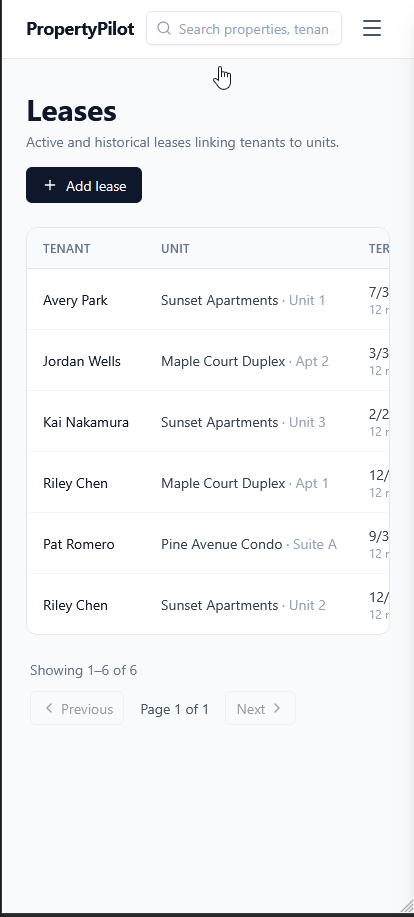
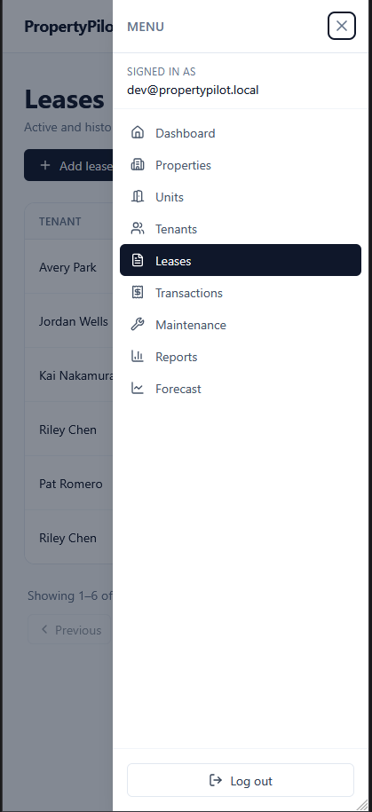
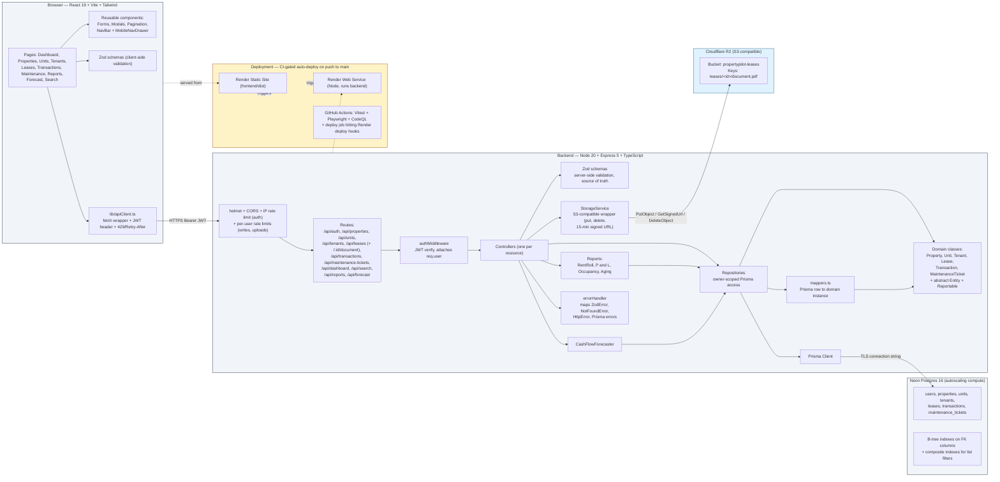

# PropertyPilot

**A full-stack property management app for small residential landlords.** Track properties, tenants, leases, rent and expenses, and maintenance tickets — then get standard reports and a 12-month cash flow forecast, all from one dashboard.

**🔗 Live demo:** <https://propertypilot-frontend.onrender.com> — sign in as `dev@propertypilot.local` / `dev1234`. Pre-loaded with 3 properties, 6 leases, a year of transactions, and 8 maintenance tickets so every report and the forecast render with real data.


The problem: small landlords with 1–10 units run their whole operation from a spreadsheet. Rent, expenses, lease dates, and maintenance backlogs all live in different tabs, and there's no easy way to project cash flow. PropertyPilot replaces that spreadsheet with structured domain records, four standard reports, and a per-property forecast — while keeping the daily workflow (recording a payment, opening a ticket) fast.

Built by [Michael Riehm](https://github.com/MichaelRiehm) as a portfolio project demonstrating full-stack TypeScript, a real domain model, and an AI-assisted development workflow (see below).

---

## What it does

- **CRUD across the full domain** — properties, units, tenants, leases, transactions (rent, deposits, expenses, refunds), maintenance tickets. Every query is owner-scoped so users can't see each other's data.
- **Four standard reports** with CSV export — Rent Roll, YTD Profit & Loss, Occupancy, Maintenance Aging (buckets by age).
- **12-month cash flow forecast per property** — projects income from active leases forward and expenses from a trailing average, flags months where projected expenses exceed income.
- **Cross-entity search** — one input hits properties, tenants, and transactions in parallel.
- **Lease document upload** — Cloudflare R2 (S3-compatible) with a 10 MB per-file cap, PDF-only, served through a short-lived signed URL. Legacy external URLs still pass through unchanged.
- **Mobile-responsive navigation** — hamburger + slide-in drawer with focus trap, escape-to-close, and focus restoration under 768px.
- **Full auth + abuse defenses** — JWT + bcrypt (cost 12), IP-based rate limits on login/register, per-user rate limits on writes and uploads keyed on the authenticated user id, helmet + CORS on every response.
- **~250 unit tests** — domain classes, repositories, controllers, auth middleware, rate-limiter predicates. All with mocked Prisma so the suite runs in under two seconds.
- **Playwright E2E** — headless Chromium covers register, sign-in, add-property, read-a-report, and mobile-nav drawer behavior against real dev servers on every PR.

## Screenshots

<table>
  <tr>
    <td width="50%"><a href="docs/screenshots/reports-aging.png"></a><br/><sub><b>Maintenance Aging report</b> — tickets bucketed by age with CSV export.</sub></td>
    <td width="50%"><a href="docs/screenshots/forecast.png"></a><br/><sub><b>12-month forecast</b> — active leases forward, trailing expense average.</sub></td>
  </tr>
  <tr>
    <td width="50%"><a href="docs/screenshots/properties.png"></a><br/><sub><b>Properties list</b> — paginated, filterable, one row per property.</sub></td>
    <td width="50%"><a href="docs/screenshots/add-property-modal.png"></a><br/><sub><b>Add Property modal</b> — validated client-side and server-side with the same Zod schemas.</sub></td>
  </tr>
  <tr>
    <td width="50%" align="center"><a href="docs/screenshots/mobile-hamburger-menu.png"></a><br/><sub><b>Mobile — leases list</b> — responsive header (logo + search + hamburger) below the <code>md:</code> breakpoint.</sub></td>
    <td width="50%" align="center"><a href="docs/screenshots/mobile-side-nav.png"></a><br/><sub><b>Mobile — navigation drawer</b> — slide-in, focus-trapped, escape closes, restores focus to hamburger.</sub></td>
  </tr>
</table>

## Tech stack

| Layer | Choices |
|---|---|
| **Frontend** | React 19, TypeScript, Vite, Tailwind, React Router 7, React Hook Form, Zod, recharts, lucide-react |
| **Backend** | Node 20, Express 5, TypeScript, Prisma 6, PostgreSQL 16, bcrypt, jsonwebtoken, Zod, helmet, cors, express-rate-limit, multer, @aws-sdk/client-s3 (Cloudflare R2) |
| **Testing** | Vitest — ~250 unit tests with mocked Prisma, sub-2s suite. Playwright for browser-level E2E on every PR. |
| **Local dev** | Docker Compose (Postgres 16), npm workspaces monorepo |
| **Deploy** | Multi-stage Dockerfiles, Render (static site + Docker web service), Neon Postgres, Cloudflare R2 for uploads, CI-gated auto-deploy on push to `main` |

## Architecture

Three tiers, layered backend, one domain model that carries the OO story:



*Diagram source: [`docs/diagrams/architecture-diagram.mmd`](docs/diagrams/architecture-diagram.mmd).*

- **Layered backend.** `routes → auth middleware → controllers → repositories → Prisma`. Controllers never touch Prisma; repositories are the only layer that does.
- **Domain classes on top of Prisma.** An abstract `Entity` base with concrete `Property`, `Unit`, `Tenant`, `Lease`, `Transaction`, `MaintenanceTicket` classes. Each implements a polymorphic `validate()` and satisfies a `Reportable` interface. Prisma stays for type-safe SQL; the domain classes hold the behavior. See the [class diagram](docs/diagrams/class-diagram.md).
- **Same Zod schemas both sides.** The frontend gets instant field validation from the same Zod definitions the server treats as authoritative. Client-side is for UX, server-side is the source of truth.
- **Owner-scoped queries everywhere.** Repositories take `ownerId` and bake it into every `where` clause (direct or via join). The test suite pins that contract for every repository so a bad refactor fails immediately.

## Getting started

Prereqs: **Node 20+**, **Docker Desktop**, **Git**.

```powershell
git clone https://github.com/MichaelRiehm/PropertyPilot.git
cd PropertyPilot

# One-time env setup
Copy-Item .env.example .env
npm install

# Full local demo: postgres + migrate + seed + dev servers
npm run demo
```

Then open <http://localhost:5173> and sign in as:

- **Email** `dev@propertypilot.local`
- **Password** `dev1234`

The seed populates a demo landlord with 3 properties, 7 units, 5 tenants, 6 leases (mixed statuses), a year of monthly rent payments, expenses across 6 categories, and 8 maintenance tickets across all 4 aging buckets — enough to make every report and the forecast look convincing.

### Useful commands

| Command | What it does |
|---|---|
| `npm run demo` | End-to-end: start Postgres, migrate, seed, boot both dev servers |
| `npm run dev` | Boot backend + frontend dev servers (assumes DB already up) |
| `npm run test` | Vitest across both workspaces |
| `npm run e2e:install` | One-time: install Playwright + Chromium |
| `npm run test:e2e` | Playwright E2E against the local dev stack |
| `npm run build` | Type-check and build both workspaces for production |
| `npm run db:up` \| `db:migrate` \| `db:seed` | Compose primitives, run individually |
| `npm run db:reset` | Drop + recreate + reseed (destructive; asks for confirmation) |
| `docker compose up -d` | Full production-parity stack in Docker (postgres + backend + frontend + nginx) |

## AI-assisted development workflow

PropertyPilot is built the way I'd build production software with an AI copilot in 2026: **issues drive branches, agents draft PRs, CI + AI review before I merge.** This isn't marketing — it's the actual loop this repo uses. The purpose:

- Turn any well-scoped roadmap item into a branch + PR without me hand-typing the boilerplate
- Keep humans in the loop where judgement matters (design, review, merge)
- Get consistent code review even on a single-developer project

### The loop

```
GitHub Issue  (small, well-scoped feature or fix)
   │
   ▼
AI agent (Claude Code) implements on a branch, self-reviews, opens a PR
   │
   ▼
CI on the PR (jobs run concurrently):
   ├─ Vitest unit tests           backend + frontend
   ├─ Playwright E2E              headless Chromium vs real dev servers
   └─ CodeQL security analysis    JS/TS + Actions
   │
   ▼
Human review: read the diff, check the tests, request changes if needed
   │
   ▼
Merge to main
   │
   ▼
CI auto-deploys backend + frontend to Render on push to main
```

### What's in this repo to support it

- **[`CLAUDE.md`](CLAUDE.md)** — a codebase-context file that gives any AI agent the architecture map, conventions, and gotchas needed to work productively here. Also useful as an onboarding doc for a new human contributor.
- **`.github/ISSUE_TEMPLATE/`** + **`.github/pull_request_template.md`** — templates that reflect this workflow, so every issue and PR carries the same shape.
- **`.github/workflows/ci.yml`** — Vitest, Playwright, build/typecheck on every PR; a `deploy` job that hits Render deploy hooks on push to `main` so `main` is always the deployed version.
- **`.github/workflows/codeql.yml`** — CodeQL static analysis for JavaScript/TypeScript and the Actions workflow files themselves; runs on PRs, on push to `main`, and weekly on a cron.
- **`.github/dependabot.yml`** — weekly dependency PRs grouped by ecosystem (AWS SDK, dev-deps) so upgrades surface as small, reviewable PRs instead of a quarterly panic. Major-version bumps of stack-defining packages (Tailwind, TypeScript, Prisma) are held for manual migration.
- **AI-assisted review via [Claude Code](https://claude.com/claude-code)** — Claude Code (running against the [`CLAUDE.md`](CLAUDE.md) context) drafts each PR and inspects its own diff before pushing. Automated Dependabot PRs get reviewed with the same session, which is how major-bump breakage (e.g. Prisma 7's dropped schema syntax) gets caught before merge.
- **Small, well-scoped issues** — the roadmap below is broken into issues that fit this pattern (one afternoon of work each, one PR each).

## Roadmap

Full backlog with acceptance criteria lives in the [Issues tab](https://github.com/MichaelRiehm/PropertyPilot/issues). The bigger items I'd tackle next:

- **Email notifications** — rent-due reminders, ticket-status changes, lease-renewal warnings. Queue-based (BullMQ + Redis + Resend) so the API stays fast.
- **Multi-user / multi-property manager accounts** — every user is currently their own owner. Add a `Manager` role that can access multiple owners' portfolios (property-management-company scenario).
- **Mobile-friendly report tables** — the nav is already mobile-responsive (see screenshots above); the report tables still use fixed-width layouts that need to be converted to stacked cards under 768px.
- **Framework major-version migrations** — [Tailwind 4](https://github.com/MichaelRiehm/PropertyPilot/issues/33), [TypeScript 7](https://github.com/MichaelRiehm/PropertyPilot/issues/43), [Prisma 7](https://github.com/MichaelRiehm/PropertyPilot/issues/44). Each is held for manual migration by the Dependabot ignore rules, with a scoped issue describing the migration checklist.

## License

MIT — see [LICENSE](LICENSE).

---

Built by [Michael Riehm](https://github.com/MichaelRiehm). Questions, feedback, or interested in hiring me? Open an issue or reach out on LinkedIn.
