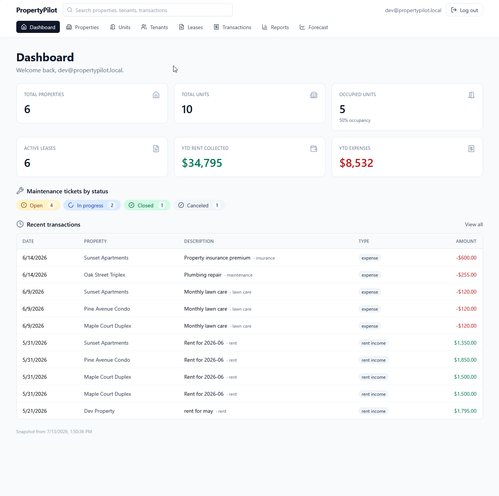
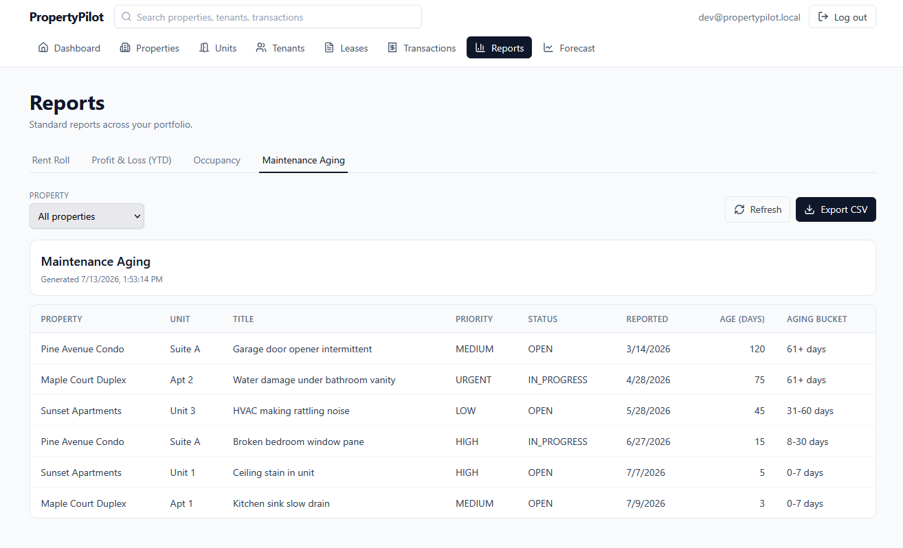
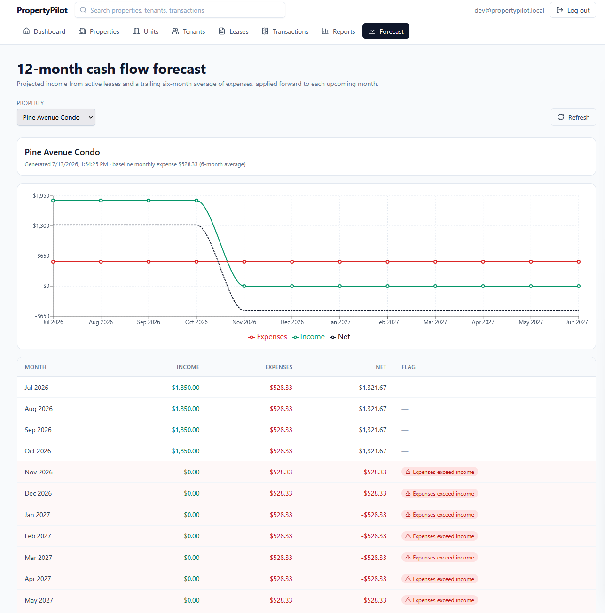
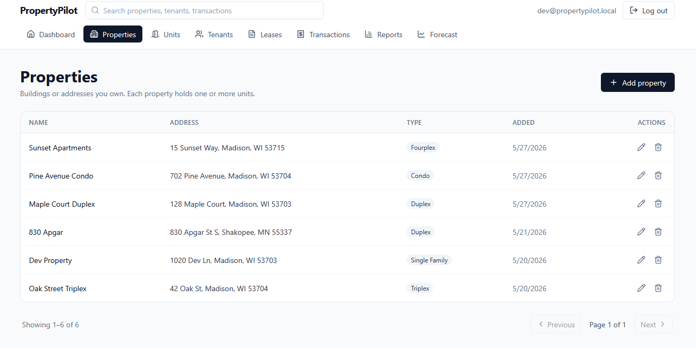
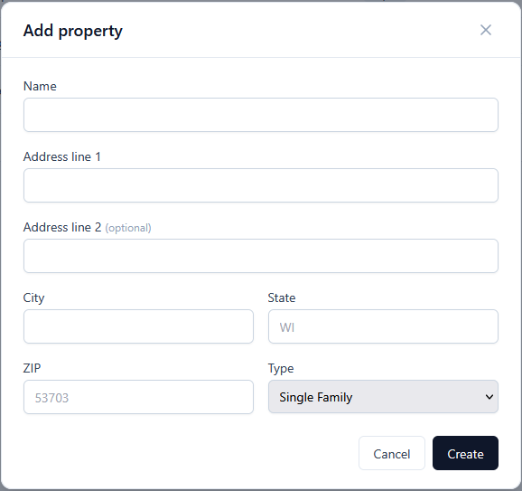

# PropertyPilot

**A full-stack property management app for small residential landlords.** Track properties, tenants, leases, rent and expenses, and maintenance tickets — then get standard reports and a 12-month cash flow forecast, all from one dashboard.

**🔗 Live demo:** <https://propertypilot-frontend.onrender.com> — sign in as `dev@propertypilot.local` / `dev1234`. Pre-loaded with 3 properties, 6 leases, a year of transactions, and 8 maintenance tickets so every report and the forecast render with real data.




The problem: small landlords with 1–10 units run their whole operation from a spreadsheet. Rent, expenses, lease dates, and maintenance backlogs all live in different tabs, and there's no easy way to project cash flow. PropertyPilot replaces that spreadsheet with structured domain records, four standard reports, and a per-property forecast — while keeping the daily workflow (recording a payment, opening a ticket) fast.

Built by [Michael Riehm](https://github.com/MichaelRiehm) as a portfolio project demonstrating full-stack TypeScript, a real domain model, and an AI-assisted development workflow (see below).

---

## What it does

- **CRUD across the full domain** — properties, units, tenants, leases, transactions (rent, deposits, expenses, refunds), maintenance tickets. Every query is owner-scoped so users can't see each other's data.
- **Four standard reports** with CSV export — Rent Roll, YTD Profit & Loss, Occupancy, Maintenance Aging (buckets by age).
- **12-month cash flow forecast per property** — projects income from active leases forward and expenses from a trailing average, flags months where projected expenses exceed income.
- **Cross-entity search** — one input hits properties, tenants, and transactions in parallel.
- **Full auth stack** — JWT + bcrypt (cost 12), rate-limited auth endpoints, helmet + CORS on every response.
- **227 unit tests** — domain classes, repositories, controllers, and the auth middleware, all with mocked Prisma.
- **Playwright E2E** — headless Chromium covers register, sign-in, add-property, and read-a-report against the real dev servers on every PR.

## Screenshots

<table>
  <tr>
    <td width="50%"><a href="docs/screenshots/reports-aging.png"></a><br/><sub><b>Maintenance Aging report</b> — tickets bucketed by age with CSV export.</sub></td>
    <td width="50%"><a href="docs/screenshots/forecast.png"></a><br/><sub><b>12-month forecast</b> — active leases forward, trailing expense average.</sub></td>
  </tr>
  <tr>
    <td width="50%"><a href="docs/screenshots/properties.png"></a><br/><sub><b>Properties list</b> — paginated, filterable, one row per property.</sub></td>
    <td width="50%"><a href="docs/screenshots/add-property-modal.png"></a><br/><sub><b>Add Property modal</b> — validated client-side and server-side with the same Zod schemas.</sub></td>
  </tr>
</table>

## Tech stack

| Layer | Choices |
|---|---|
| **Frontend** | React 19, TypeScript, Vite, Tailwind, React Router 7, React Hook Form, Zod, recharts, lucide-react |
| **Backend** | Node 20, Express 5, TypeScript, Prisma 6, PostgreSQL 16, bcrypt, jsonwebtoken, Zod, helmet, cors, express-rate-limit |
| **Testing** | Vitest (backend + frontend workspaces) — 227 unit tests, mocked Prisma, no DB needed. Playwright for browser-level E2E on every PR. |
| **Local dev** | Docker Compose (Postgres 16), npm workspaces monorepo |
| **Deploy** | Multi-stage Dockerfiles, Render (static site + Docker web service + managed Postgres) |

## Architecture

Three tiers, layered backend, one domain model that carries the OO story:


- **Layered backend.** `routes → auth middleware → controllers → repositories → Prisma`. Controllers never touch Prisma; repositories are the only layer that does.
- **Domain classes on top of Prisma.** An abstract `Entity` base with concrete `Property`, `Unit`, `Tenant`, `Lease`, `Transaction`, `MaintenanceTicket` classes. Each implements a polymorphic `validate()` and satisfies a `Reportable` interface. Prisma stays for type-safe SQL; the domain classes hold the behavior. See the [class diagram](docs/diagrams/class-diagram.png).
- **Same Zod schemas both sides.** The frontend gets instant field validation from the same Zod definitions the server treats as authoritative. Client-side is for UX, server-side is the source of truth.
- **Owner-scoped queries everywhere.** Repositories take `ownerId` and bake it into every `where` clause (direct or via join). The test suite pins that contract for every repository so a bad refactor fails immediately.

## Getting started

Prereqs: **Node 20+**, **Docker Desktop**, **Git**.

```powershell
git clone https://github.com/MichaelRiehm/PropertyPilot.git
cd PropertyPilot

# One-time env setup
Copy-Item .env.example .env
npm install

# Full local demo: postgres + migrate + seed + dev servers
npm run demo
```

Then open <http://localhost:5173> and sign in as:

- **Email** `dev@propertypilot.local`
- **Password** `dev1234`

The seed populates a demo landlord with 3 properties, 7 units, 5 tenants, 6 leases (mixed statuses), a year of monthly rent payments, expenses across 6 categories, and 8 maintenance tickets across all 4 aging buckets — enough to make every report and the forecast look convincing.

### Useful commands

| Command | What it does |
|---|---|
| `npm run demo` | End-to-end: start Postgres, migrate, seed, boot both dev servers |
| `npm run dev` | Boot backend + frontend dev servers (assumes DB already up) |
| `npm run test` | Vitest across both workspaces |
| `npm run e2e:install` | One-time: install Playwright + Chromium |
| `npm run test:e2e` | Playwright E2E against the local dev stack |
| `npm run build` | Type-check and build both workspaces for production |
| `npm run db:up` \| `db:migrate` \| `db:seed` | Compose primitives, run individually |
| `npm run db:reset` | Drop + recreate + reseed (destructive; asks for confirmation) |
| `docker compose up -d` | Full production-parity stack in Docker (postgres + backend + frontend + nginx) |

## AI-assisted development workflow

PropertyPilot is built the way I'd build production software with an AI copilot in 2026: **issues drive branches, agents draft PRs, CI + AI review before I merge.** This isn't marketing — it's the actual loop this repo uses. The purpose:

- Turn any well-scoped roadmap item into a branch + PR without me hand-typing the boilerplate
- Keep humans in the loop where judgement matters (design, review, merge)
- Get consistent code review even on a single-developer project

### The loop

```
GitHub Issue
   │  (small, well-scoped feature or fix)
   ▼
AI agent implements on a branch, opens a PR
   │
   ▼
CI runs (lint + build + tests)   ─┐
AI review posts a PR comment      ├─  parallel
                                   ─┘
   │
   ▼
Human (me) reviews AI's findings, edits if needed, approves
   │
   ▼
Merge to main → main is always green
```

### What's in this repo to support it

- **[`CLAUDE.md`](CLAUDE.md)** — a codebase-context file that gives any AI agent the architecture map, conventions, and gotchas needed to work productively here. Also useful as an onboarding doc for a new human contributor.
- **`.github/ISSUE_TEMPLATE/`** + **`.github/pull_request_template.md`** — templates that reflect this workflow, so every issue and PR carries the same shape.
- **`.github/workflows/`** — GitHub Actions running lint, build, and the full Vitest suite on every PR. An AI-review job (optional) runs a code review pass and comments on the PR.
- **Small, well-scoped issues** — the roadmap below is broken into issues that fit this pattern (one afternoon of work each, one PR each).

### Why this matters for hiring

Small teams and one-person startups can now ship what used to take 3–5 engineers, if the human at the wheel knows how to steer an AI. That skill is what this repo is designed to demonstrate: **prompting, reviewing, and integrating AI output into a maintainable codebase.**

## Roadmap

Small, well-scoped items I'd tackle next. Each becomes an issue → branch → PR.

- **Multi-user / multi-property manager accounts** — currently every user is their own owner. Add a `Manager` role that can access multiple owners' portfolios (property-management-company scenario).
- **Lease document upload** — replace the current `documentLink` URL field with a real file upload path (S3 or Render's object storage) and a signed-URL viewer.
- **Email notifications** — rent-due reminders, ticket-status changes, lease-renewal warnings. Queue-based (BullMQ + Redis) so the API stays fast.
- **Maintenance ticket CRUD UI** — currently ticket data exists (dashboard chips + aging report) but there's no create/edit page for owners. One CRUD page pattern already exists in five other places, so this is a mechanical add.
- **Mobile-friendly reports** — the tables are cramped under 768px. Convert to responsive card layouts on narrow viewports.
- **Playwright end-to-end tests** — unit coverage is solid (209 tests) but there's no browser-level regression test on the critical flows (register → add property → record rent → view P&L).

## License

MIT — see [LICENSE](LICENSE).

---

Built by [Michael Riehm](https://github.com/MichaelRiehm). Questions, feedback, or interested in hiring me? Open an issue or reach out on LinkedIn.
