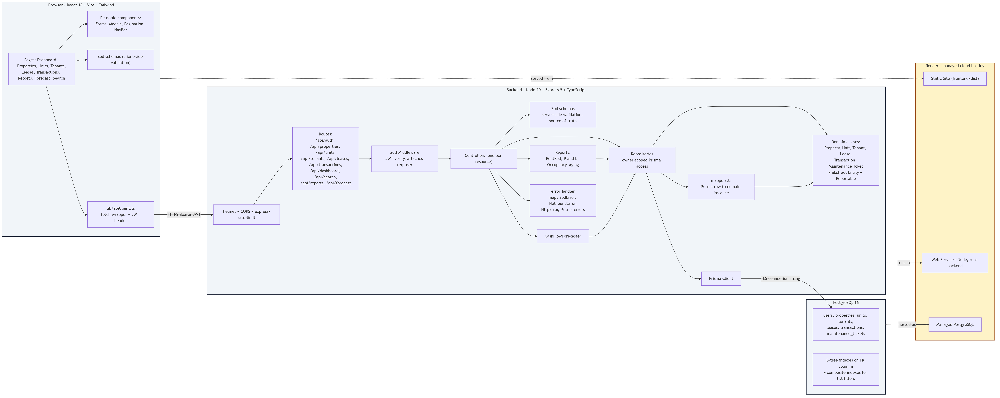
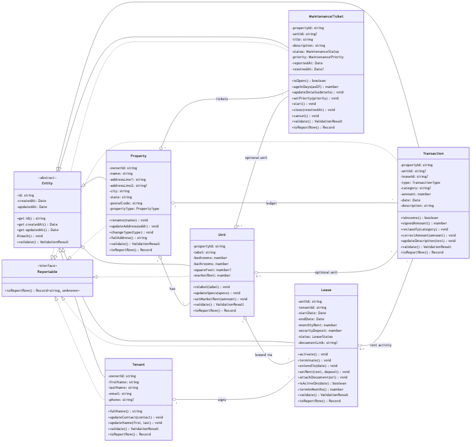

# PropertyPilot — Design Document

**Project:** PropertyPilot (WGU D424 Software Engineering Capstone)
**Author:** Michael Riehm
**Last updated:** 2026-06-04
**Repository:** _GitLab URL added under Task 3.C.3 after deployment_
**Deployed application:** _Render URL added under Task 3.C.2 after deployment_

---

## 1. System Overview

### 1.1 Purpose

PropertyPilot is a single-tenant SaaS-style web application that gives small residential landlords (1–10 units) a structured replacement for the spreadsheets they typically use to track properties, tenants, leases, rent payments, expenses, and maintenance work. The application produces standard property-management reports and a 12-month cash flow forecast per property.

### 1.2 Users

The system serves one user type: **the landlord/owner**. There is no tenant-facing portal, no admin role, and no multi-organization tooling. Every record is scoped to the owner who created it; one landlord cannot see another's data.

### 1.3 Core capabilities

| Capability | What the user can do |
|---|---|
| Account | Register, sign in, sign out. JWT-based session. |
| Inventory | Add, edit, delete properties; add units inside each property. |
| People | Add tenants. Tenants are owner-scoped people, not unit-bound. |
| Leases | Connect one tenant to one unit for a date range with rent and deposit. |
| Money | Record rent income, deposits, other income, expenses, and refunds. |
| Insights | Dashboard, four standard reports, cross-entity search, 12-month forecast. |

### 1.4 Out of scope

File uploads (lease PDFs are linked, not hosted), tenant-facing portals, email notifications, payment processing, and multi-organization administration are explicitly out of scope for this release.

---

## 2. Architecture

### 2.1 Logical tiers

PropertyPilot is a conventional three-tier web application:

1. **Browser tier** — React 18 single-page app, bundled by Vite, styled with Tailwind. Talks to the API over HTTPS.
2. **Backend tier** — Node 20 + Express 5 + TypeScript REST API. Stateless; every request is authenticated independently by JWT.
3. **Data tier** — PostgreSQL 16, accessed only through Prisma. No raw SQL in application code.

A full architecture diagram is in [`diagrams/architecture-diagram.mmd`](diagrams/architecture-diagram.mmd) (rendered to `diagrams/architecture-diagram.png`).



### 2.2 Internal backend layering

The backend follows a strict layered architecture. Each layer depends only on the one below it:

```
HTTP request
   │
   ▼
helmet / CORS / rate limit
   │
   ▼
Routes  ─── /api/auth (public)
   │  ─── everything else
   ▼
authMiddleware (JWT verify → req.user)
   │
   ▼
Controllers  ──► Reports / Forecast
   │
   ▼
Repositories (owner-scoped Prisma queries)
   │
   ▼
Prisma Client ──► PostgreSQL
```

The **domain layer** (`Property`, `Unit`, `Tenant`, `Lease`, `Transaction`, `MaintenanceTicket` + abstract `Entity` + `Reportable` interface) sits alongside the repositories. **Mappers** translate between Prisma row shapes and domain instances; controllers never see Prisma rows directly.

### 2.3 Deployment topology

Production runs on Render with three services:

| Service | Type | Build / start |
|---|---|---|
| Frontend | Static Site | `npm install && npm run build -w frontend` → publish `frontend/dist` |
| Backend | Web Service (Node) | `npm install && npm run build -w backend && npm run start -w backend` |
| Database | Managed PostgreSQL | Render-provisioned `DATABASE_URL` injected into the backend service |

The backend's CORS middleware is restricted to the Render frontend origin via the `FRONTEND_URL` env var. TLS termination is handled by Render at the edge. Justification for choosing Render over alternatives lives in [`cloud-provider-justification.md`](cloud-provider-justification.md) (added under Task 4.A.1).

### 2.4 Stack inventory

| Layer | Technologies |
|---|---|
| Frontend | React 19, TypeScript, Vite, React Router 7, React Hook Form, Zod, Tailwind 3, lucide-react, recharts |
| Backend | Node 20, Express 5, TypeScript, Prisma 6, Zod, bcrypt, jsonwebtoken, helmet, cors, express-rate-limit, dotenv |
| Database | PostgreSQL 16 (Docker locally, Render-managed in production) |
| Tests | Vitest 4 (backend unit tests, mocked Prisma) |
| Containerization | Docker + docker-compose (local), Render-managed containers (production) |
| Version control | GitLab |

No additional dependencies are introduced outside this list.

---

## 3. Class Structure

### 3.1 Domain class diagram

The full UML class diagram is in [`diagrams/class-diagram.mmd`](diagrams/class-diagram.mmd) (rendered to `diagrams/class-diagram.png`).



### 3.2 Inheritance — abstract `Entity` base

Every concrete domain class extends an abstract `Entity` base ([`backend/src/domain/Entity.ts`](../backend/src/domain/Entity.ts)).

`Entity` owns the three identity / audit fields that every record needs:

- `id: string` — server-generated UUID
- `createdAt: Date`
- `updatedAt: Date`

It exposes them through read-only getters and provides a single protected mutator, `touch()`, which subclasses call from any state-changing method to keep the `updatedAt` invariant. The class declares one abstract method, `validate(): ValidationResult`, that every concrete subclass must implement.

Concrete subclasses: `Property`, `Unit`, `Tenant`, `Lease`, `Transaction`, `MaintenanceTicket`.

### 3.3 Polymorphism — `validate()` and `Reportable`

There are two polymorphism axes in the domain layer:

1. **`Entity.validate()`** is abstract on the base. Each subclass supplies its own rules — e.g., `Lease.validate()` enforces `startDate < endDate` and a positive `monthlyRent`; `Transaction.validate()` requires `leaseId` when `type === 'RENT_INCOME'`. Repositories call `validate()` polymorphically before any `create` or `update` and throw `DomainValidationError` on failure.
2. **`Reportable.toReportRow()`** is implemented by every concrete domain class. Each returns a different shape suitable for inclusion in a report row, so the same interface call produces different row schemas depending on the runtime type of the receiver.

A second polymorphic family lives in the reports layer ([`backend/src/reports/Report.ts`](../backend/src/reports/Report.ts)): an abstract `Report` base declares `generate(): Promise<void>` and a concrete `toJSON()`. Subclasses `RentRollReport`, `PnLReport`, `OccupancyReport`, and `MaintenanceAgingReport` each implement `generate()` against the repository layer. The controllers can hold a `Report` reference and call `generate()` without knowing which concrete report they have.

### 3.4 Encapsulation — private state, intention-revealing mutators

All instance state on every domain class is `private`. Public access is through getters; mutation only through intention-revealing methods.

Examples:

| Class | Mutator | What it does |
|---|---|---|
| `Property` | `rename(name)` | Validates and updates `name`, calls `touch()` |
| `Property` | `updateAddress({ ... })` | Updates all address fields atomically |
| `Lease` | `terminate()` | Sets status to `TERMINATED`, bumps `updatedAt` |
| `Lease` | `extendTo(date)` | Pushes `endDate` forward (must be after current end) |
| `Unit` | `setMarketRent(amount)` | Validates ≥ 0, updates rent |
| `Transaction` | `reclassify(category)` | Changes only the category, not the amount |
| `Transaction` | `correctAmount(amount)` | Changes only the amount, leaves type intact |
| `MaintenanceTicket` | `close(resolvedAt)` | Sets status to `CLOSED` and stamps `resolvedAt` |

Callers cannot stuff arbitrary new field values into an entity by hand — every state change has to go through a named method that knows the invariant it is preserving.

### 3.5 Repository pattern

Domain classes are persistence-ignorant. The repository layer ([`backend/src/repositories/`](../backend/src/repositories/)) wraps Prisma and is the only place that knows about database rows. Every concrete repository extends `BaseRepository<T, F>`, which:

- declares the standard CRUD signatures (`findById`, `list`, `create`, `update`, `delete`)
- provides `ensureValid(entity)` that calls `entity.validate()` and throws `DomainValidationError` on failure
- provides `resolvePagination(filter)` and `paginate(rows, total, page, pageSize)` so every list endpoint has the same paginated shape and the same default/maximum page sizes (20 default, 200 max)

The repositories enforce owner scoping in every query. For `Property` and `Tenant`, that means `where: { id, ownerId }`. For `Unit`, `Transaction`, and `MaintenanceTicket`, it means a join: `where: { id, property: { ownerId } }`. For `Lease`, it is a two-level join: `where: { id, unit: { property: { ownerId } } }`. A user can never reach another user's data, because the where clause filters it out before any business logic runs.

### 3.6 Mappers

`backend/src/domain/mappers.ts` contains pure functions that translate between Prisma row shapes and domain class instances. Repositories call `xxxFromPrisma(row)` when reading and `xxxToCreateInput(entity)` / `xxxToUpdateInput(entity)` when writing. The mapper layer is what lets the rest of the codebase work with rich domain classes instead of anemic Prisma records, without leaking Prisma types into the controllers.

---

## 4. Key Design Decisions and Rationale

### 4.1 Domain classes layered on top of Prisma (not as a replacement)

**Decision.** Keep Prisma as the persistence layer and add a hand-written domain class hierarchy on top of it, with mappers translating between the two.

**Why.** The capstone rubric requires visible inheritance, polymorphism, and encapsulation. Prisma's generated client is anemic by design — it returns plain objects with no behavior — and a pure-Prisma approach wouldn't satisfy the OOP requirement. At the same time, hand-writing a full ORM would be wasted effort. Layering domain classes on top of Prisma keeps the type-safe SQL Prisma gives you for free, while putting the business rules where the rubric expects them.

**Trade-off.** Every read/write goes through a mapping step. The cost is one small pure function call per entity per request, which is cheap. The benefit is that the controllers, reports, and forecaster all manipulate domain instances with named methods, and the data layer stays swappable in principle.

### 4.2 Repository pattern with mandatory owner scoping

**Decision.** All Prisma calls live behind a repository class. Every query takes `ownerId` and bakes it into the `where` clause.

**Why.** Owner scoping is the most important invariant in a multi-tenant app: one user must never see another user's data. Centralizing it in the repository layer means there is exactly one place per resource where the scoping is enforced, and the test suite has an explicit "scopes through ..." case for every repository (see [`test-plan.md`](test-plan.md) §3.3). A bug that drops the scoping from one endpoint will fail a test immediately.

### 4.3 Server-side Zod schemas as the source of truth, mirrored on the client

**Decision.** Every request body and query parameter is parsed through a Zod schema in the controller. The frontend uses Zod schemas of its own for form validation, but the server-side schemas are authoritative.

**Why.** Client-side validation is for UX; server-side validation is for integrity. Doing both means users get instant feedback in the form, and the server still rejects anything that bypasses the form (e.g. someone using the API directly). Keeping the schemas in two places is a small synchronization tax, but Zod's API is the same in both worlds so it is a copy-and-paste tax, not a translation tax.

### 4.4 Stateless backend

**Decision.** No server-side session state. Each request carries a JWT in `Authorization: Bearer <token>` and is verified independently.

**Why.** Render's free tier restarts containers regularly and may scale them in or out without warning. A stateless backend means no sessions to invalidate, no sticky-session requirement, and rolling restarts are free. The rate-limit middleware uses an in-memory store, but it only protects auth endpoints from brute force on a single host and is acceptable to lose on a restart. See [`backend/src/app.ts`](../backend/src/app.ts) for the inline rationale.

### 4.5 Reports as a class hierarchy, generated on demand

**Decision.** Each report is an `Report`-subclass with a `generate()` method that pulls from repositories. The controller constructs the report, calls `generate()`, and returns `toJSON()`.

**Why.** This pattern satisfies the rubric's polymorphism requirement a second time, and keeps the report-specific math out of the controller. It also makes a future caching or scheduled-report feature straightforward — the controller does not need to know how a report is built, only that it is.

### 4.6 Forecast computed on demand, not stored

**Decision.** The 12-month forecast is calculated each time the endpoint is hit. Nothing is materialized.

**Why.** The dataset is small (one landlord, dozens of leases at most, a few hundred transactions per year), and the math is cheap. Storing forecasts would introduce a staleness problem — if the user adds a new lease or expense, the stored forecast would be wrong until refreshed. Recomputing keeps the user's mental model simple: "the forecast reflects the current data."

### 4.7 Vitest only

**Decision.** Use Vitest exclusively. No Jest, no Mocha.

**Why.** Vitest is TypeScript-native and integrates cleanly with the Vite-based frontend. Having one test framework across both workspaces keeps the developer surface area small and shared configuration possible.

### 4.8 Docker for local Postgres, but not for the app itself in development

**Decision.** Local Postgres runs in a Docker container via `docker-compose`. The dev backend and frontend run as plain Node processes via `npm run dev`.

**Why.** Postgres in Docker is a one-line setup that matches production exactly, with no native-Postgres install. But running the app in Docker locally would slow file watchers and complicate debugging. Two terminals (`docker compose up -d` once, then `npm run dev`) is the lowest-friction setup for daily development.

---

## 5. Security Architecture

A complete summary; see also [`maintenance-guide.md`](maintenance-guide.md) §4 for env var management.

### 5.1 Authentication

- **Password storage.** `bcrypt` with cost factor 12. Hashes are never returned in any API response — `serializeUser()` projects only `id`, `email`, `createdAt`, `updatedAt`.
- **Token issuance.** On successful register or login, the backend signs a JWT containing `{ sub: user.id, email: user.email }` with `JWT_SECRET` and a 24-hour expiry.
- **Token transport.** The browser stores the JWT in `localStorage` and attaches it as `Authorization: Bearer <token>` on every API call via [`frontend/src/lib/apiClient.ts`](../frontend/src/lib/apiClient.ts).
- **Token verification.** [`backend/src/middleware/auth.ts`](../backend/src/middleware/auth.ts) verifies the bearer token, accepts a case-insensitive `Bearer` prefix, and rejects missing / malformed / empty / expired tokens with `HttpError(401)`. Verifier errors are masked — the message handed to `next()` never includes raw `jsonwebtoken` error text.

### 5.2 Authorization

- **Auth middleware.** Mounted on every route under `/api` except `/api/auth/login` and `/api/auth/register`. Attaches `req.user = { id, email }`.
- **Owner scoping.** Every repository query takes `ownerId` and filters by it (direct or via join). The test suite pins this contract for every repository (see [`test-plan.md`](test-plan.md) §3.3, "scopes through ..." cases).

### 5.3 Transport and HTTP hardening

- **HTTPS.** Render terminates TLS at the edge for both the static site and the API.
- **`helmet`** sets the standard set of security headers (X-Frame-Options, X-Content-Type-Options, Strict-Transport-Security, etc.).
- **`cors`** is restricted to the configured `FRONTEND_URL` only. Wildcard origins are never used.
- **`express-rate-limit`** is applied to the `/api/auth/*` endpoints to slow brute-force attempts. The limit is an in-process counter; in a multi-instance deploy this would move to Redis, but for the single-instance Render Web Service it is sufficient.

### 5.4 Input validation

Every request body and query parameter is parsed through a Zod schema (`backend/src/schemas/*.ts`) in the controller. The schemas reject:

- missing required fields,
- wrong types,
- out-of-range numerics (e.g., `monthsAhead` clamped to 1–36 on the forecast endpoint),
- malformed emails / phones / postal codes,
- empty search queries.

The frontend uses a mirrored set of Zod schemas (`frontend/src/schemas/*.ts`) so form errors surface in the field UI before submission, but the server-side schemas are the source of truth.

### 5.5 SQL safety

All database access goes through Prisma. There are no raw SQL queries anywhere in the codebase. Prisma parameterizes every query, so SQL injection through user input is structurally impossible at the application layer.

### 5.6 Secrets management

The four configuration values (`DATABASE_URL`, `JWT_SECRET`, `PORT`, `FRONTEND_URL`) all come from environment variables loaded from `.env` (locally) or the Render service env panel (in production). The repository's `.gitignore` excludes `.env`; only `.env.example` with placeholder values is committed. `JWT_SECRET` must be at least 16 characters or the backend refuses to start — there is no silent fallback to a default.

### 5.7 Error handling

A centralized `errorHandler` ([`backend/src/middleware/errorHandler.ts`](../backend/src/middleware/errorHandler.ts)) translates internal errors to HTTP responses:

| Internal error | HTTP status | Response shape |
|---|---|---|
| `ZodError` (validation) | 400 | `{ message, fields }` |
| `DomainValidationError` | 400 | `{ message, errors }` |
| `NotFoundError` | 404 | `{ message }` |
| `ConflictError` (e.g. duplicate email) | 409 | `{ message }` |
| `HttpError` (everything else) | as set | `{ message }` |
| Uncaught | 500 | Generic "Internal server error" (no stack to client) |

Internal stack traces are logged server-side but never returned to the browser.

---

## 6. Scalability Considerations

PropertyPilot's target audience is small landlords, so the system is designed to comfortably handle one user with a few thousand transactions per year per property — not millions of records — while still being shaped so that horizontal scaling is possible if the workload grows.

### 6.1 Pagination

Every list endpoint returns a `PaginatedResult<T>` ([`backend/src/repositories/BaseRepository.ts`](../backend/src/repositories/BaseRepository.ts)) with `{ data, total, page, pageSize, totalPages }`. The default page size is 20; the maximum the server will honor is 200. There is no endpoint that returns "all rows" without paging.

### 6.2 Database indexes

Foreign-key columns and the columns used in `WHERE` and `ORDER BY` clauses are indexed. The third migration, `20260529145255_add_scalability_indexes`, adds composite indexes on `(propertyId, date)` for `transactions` and `(propertyId, status)` for `maintenance_tickets`, which are the two hot paths for the dashboard and reports.

### 6.3 Stateless backend

See [§4.4](#44-stateless-backend). No server-side session state, so the backend scales horizontally behind a load balancer without sticky sessions. Render's blue/green deploys swap cleanly because there are no sessions to invalidate.

### 6.4 Separation of concerns

The strict layering means the bottlenecks are easy to find: if a list endpoint gets slow, it is almost always a missing index in the database; if a report is slow, it is the loop in `generate()`; if the dashboard is slow, it is the parallel `Promise.all` of seven queries. Each layer can be optimized independently.

### 6.5 Caching strategy (not yet implemented)

The forecast and the four reports are pure functions of the underlying data. Both are obvious candidates for a response cache keyed by `(ownerId, propertyId, params)` with an invalidation event tied to writes against the relevant tables. The hooks for that exist — the report and forecast layers are self-contained — but caching is not implemented in this release because the dataset is small enough that recomputing on every request is well under 100 ms.

### 6.6 Connection pooling

Prisma maintains its own connection pool against PostgreSQL. The default pool size (`num_physical_cpus * 2 + 1`) is appropriate for a single-instance Render Web Service. If the backend is scaled to multiple instances, the pool size per instance should be lowered to avoid exhausting the Postgres connection limit.

---

## 7. Other Documents

| Document | Purpose | Rubric |
|---|---|---|
| [`user-guide.md`](user-guide.md) | End-user walkthrough — register/login, CRUD flows, dashboard, reports, forecast, search | Task 3.C.5 |
| [`maintenance-guide.md`](maintenance-guide.md) | Operator setup, env vars, migrations, dev/test/build commands, deployment, troubleshooting | Task 3.C.4 |
| [`test-plan.md`](test-plan.md) | Scope, approach, and per-case test table for all 209 unit tests | Task 3.D.1 |
| [`test-results.md`](test-results.md) | Most recent run results, screenshots, summary of changes from testing | Tasks 3.D.3, 3.D.4 |
| [`diagrams/class-diagram.mmd`](diagrams/class-diagram.mmd) | UML class diagram source (Mermaid) | Task 3.C.1 |
| [`diagrams/architecture-diagram.mmd`](diagrams/architecture-diagram.mmd) | System architecture diagram source (Mermaid) | Task 3.C.1 |
| `cloud-provider-justification.md` | Why Render was chosen over alternatives | Task 4.A.1 — added during deployment |
| `deployment.md` | Step-by-step deployment instructions for Render | Task 4 — added during deployment |

### 7.1 Live URLs (added after deployment)

| Item | URL |
|---|---|
| Deployed application | <https://propertypilot-frontend.onrender.com> |
| Backend API base | <https://propertypilot-backend.onrender.com> |
| Backend health check | <https://propertypilot-backend.onrender.com/api/health> |
| GitLab repository | <https://gitlab.com/wgu-gitlab-environment/student-repos/mriehm1/d424-software-engineering-capstone> |
| Tagged release | `v1.0.0` — [browse the tagged tree](https://gitlab.com/wgu-gitlab-environment/student-repos/mriehm1/d424-software-engineering-capstone/-/tree/v1.0.0) |
| Panopto functionality demo | <https://wgu.hosted.panopto.com/Panopto/Pages/Viewer.aspx?id=f4df5cd2-8972-4fdb-946d-b466012cacb4> |
| Panopto deployment demo | _Added under Task 4.C_ |

---

## 8. References

The frameworks, libraries, services, and tools referenced throughout this document are documented at the official sources below. Architectural patterns, defaults, and capability descriptions paraphrased from these sources informed the corresponding sections of this design.

- Docker, Inc. (n.d.). *Docker documentation*. https://docs.docker.com/
- Express. (n.d.). *Express - Node.js web application framework*. https://expressjs.com/
- Helmet contributors. (n.d.). *helmet - npm*. https://www.npmjs.com/package/helmet
- Kachnit, A. (n.d.). *bcrypt - npm*. https://www.npmjs.com/package/bcrypt
- Meta Platforms. (n.d.). *React documentation*. https://react.dev/
- Microsoft. (n.d.). *TypeScript documentation*. https://www.typescriptlang.org/docs/
- Node.js contributors. (n.d.). *Node.js v20 documentation*. https://nodejs.org/docs/latest-v20.x/api/
- OpenJS Foundation. (n.d.). *jsonwebtoken - npm*. https://www.npmjs.com/package/jsonwebtoken
- PostgreSQL Global Development Group. (n.d.). *PostgreSQL 16 documentation*. https://www.postgresql.org/docs/16/index.html
- Prisma. (n.d.). *Prisma documentation*. https://www.prisma.io/docs
- Render. (n.d.). *Render documentation*. https://render.com/docs
- Vite contributors. (n.d.). *Vite — Next generation frontend tooling*. https://vitejs.dev/
- Vitest contributors. (n.d.). *Vitest — Next generation testing framework*. https://vitest.dev/
- Vlk, C. (n.d.). *Zod — TypeScript-first schema validation*. https://zod.dev/
