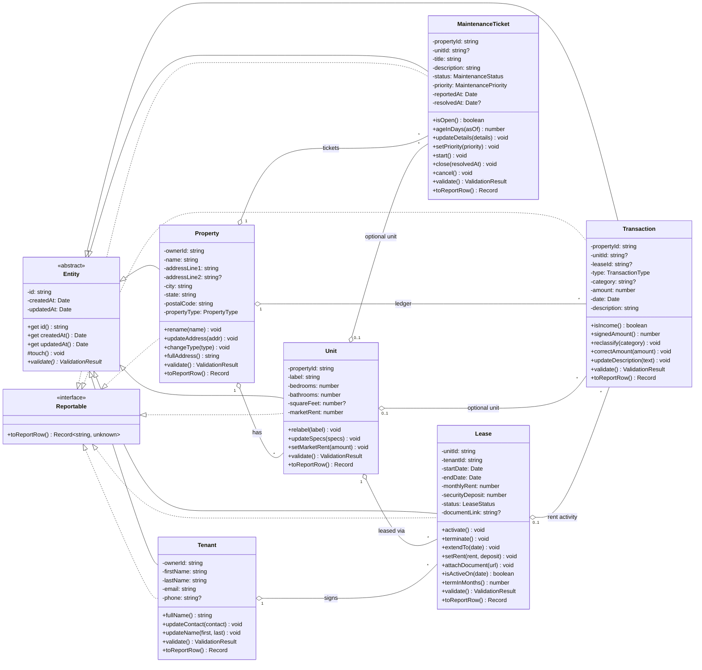

# PropertyPilot — Domain Class Diagram

Inheritance, polymorphism, and encapsulation in the domain layer.

- **Inheritance** — every concrete class extends `Entity` (abstract).
- **Polymorphism** — `validate()` is abstract on `Entity` and implemented per class. `toReportRow()` is declared on the `Reportable` interface and implemented per class with different shapes.
- **Encapsulation** — all instance state is private. Reads go through getters; mutations go through intention-revealing methods (`Property.rename()`, `Lease.terminate()`, ...) that call the protected `Entity.touch()` to maintain the `updatedAt` invariant.

Source: [`class-diagram.mmd`](class-diagram.mmd).

