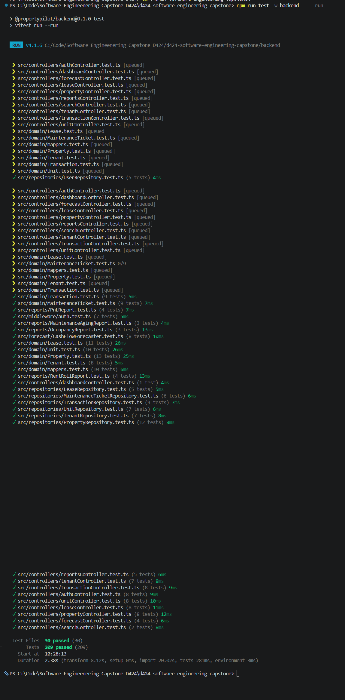
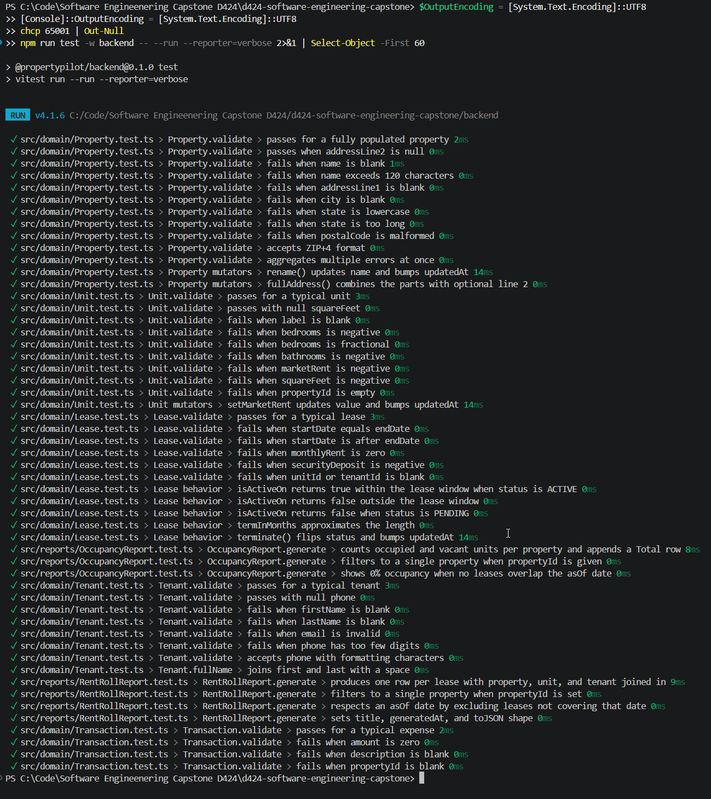

# PropertyPilot — Unit Test Results

**Project:** PropertyPilot (WGU D424 Capstone)
**Author:** Michael Riehm
**Run date:** 2026-06-01
**Tester:** Michael Riehm
**Framework:** Vitest 4.1.6
**Command:** `npm run test -w backend`

---

## 1. Headline Results

| Metric | Value |
|---|---|
| Test files | **30 passed**, 0 failed |
| Individual tests | **209 passed**, 0 failed |
| Duration | ~0.6 s (test phase) |
| Status | ✅ All green |

All 209 unit tests pass on a clean checkout with no environment setup beyond `npm install`. The suite uses mocked Prisma and JWT services, so no database or network access is required.

---

## 2. Execution Evidence

### 2.1 Summary view

The terminal summary printed at the end of `npm run test -w backend`:



### 2.2 Verbose per-test listing

The verbose reporter (`--reporter=verbose`) prints one line per individual case. This is the evidence that each of the 209 cases catalogued in [test-plan.md](test-plan.md) ran and passed.



---

## 3. Results by Layer

The 209 tests break down as follows. The counts come directly from the verbose run shown above.

| Layer | Test files | Tests | Notes |
|---|---|---|---|
| Domain classes | 6 | 60 | `Property`, `Unit`, `Tenant`, `Lease`, `Transaction`, `MaintenanceTicket` validation + behavior |
| Mappers | 1 | 10 | Round-trip Prisma ↔ domain |
| Repositories | 7 | 51 | CRUD + owner-scoping + search + pagination |
| Controllers | 10 | 59 | Success paths + 404 / ownership / Zod-validation paths |
| Auth middleware | 1 | 7 | Token verification, header parsing, error masking |
| Reports | 4 | 14 | Rent Roll, P&L, Occupancy, Maintenance Aging |
| Forecast | 1 | 8 | 12-month cash flow projection |
| **Totals** | **30** | **209** | Matches the run summary. |

---

## 4. Results by Test File

Counts taken from the verbose run. Every file shows `pass`.

| File | Tests | Status |
|---|---|---|
| `src/domain/Property.test.ts` | 13 | ✅ |
| `src/domain/Unit.test.ts` | 10 | ✅ |
| `src/domain/Tenant.test.ts` | 8 | ✅ |
| `src/domain/Lease.test.ts` | 11 | ✅ |
| `src/domain/Transaction.test.ts` | 9 | ✅ |
| `src/domain/MaintenanceTicket.test.ts` | 9 | ✅ |
| `src/domain/mappers.test.ts` | 10 | ✅ |
| `src/repositories/PropertyRepository.test.ts` | 12 | ✅ |
| `src/repositories/UnitRepository.test.ts` | 7 | ✅ |
| `src/repositories/TenantRepository.test.ts` | 7 | ✅ |
| `src/repositories/LeaseRepository.test.ts` | 5 | ✅ |
| `src/repositories/TransactionRepository.test.ts` | 9 | ✅ |
| `src/repositories/MaintenanceTicketRepository.test.ts` | 6 | ✅ |
| `src/repositories/UserRepository.test.ts` | 5 | ✅ |
| `src/middleware/auth.test.ts` | 7 | ✅ |
| `src/controllers/propertyController.test.ts` | 8 | ✅ |
| `src/controllers/unitController.test.ts` | 8 | ✅ |
| `src/controllers/tenantController.test.ts` | 7 | ✅ |
| `src/controllers/leaseController.test.ts` | 8 | ✅ |
| `src/controllers/transactionController.test.ts` | 8 | ✅ |
| `src/controllers/authController.test.ts` | 8 | ✅ |
| `src/controllers/dashboardController.test.ts` | 1 | ✅ |
| `src/controllers/searchController.test.ts` | 2 | ✅ |
| `src/controllers/reportsController.test.ts` | 5 | ✅ |
| `src/controllers/forecastController.test.ts` | 4 | ✅ |
| `src/reports/RentRollReport.test.ts` | 4 | ✅ |
| `src/reports/PnLReport.test.ts` | 4 | ✅ |
| `src/reports/OccupancyReport.test.ts` | 3 | ✅ |
| `src/reports/MaintenanceAgingReport.test.ts` | 3 | ✅ |
| `src/forecast/CashFlowForecaster.test.ts` | 8 | ✅ |
| **Total** | **209** | **All passing** |

---

## 5. Failures and Resolutions

No tests are currently failing. During development, a small number of authoring mistakes surfaced when the suite was first executed; each was resolved before the final commit. They are listed here for traceability.

| # | When | Symptom | Root cause | Fix |
|---|---|---|---|---|
| 1 | First reports-controller run | 4 assertions failed: `expected undefined to be 'Year-to-date Profit & Loss'` and similar for the other 3 reports | The test asserted `body.name`, but `Report.toJSON()` returns `{ title, generatedAt, columns, rows }` — the field is named `title`, not `name` | Updated `reportsController.test.ts` to assert `body.title` for all 4 report controllers |

After the fix above was applied, the suite ran clean and has stayed green through subsequent edits.

---

## 6. Reproducing These Results

From the repository root on a clean checkout (Node 20+, no database needed):

```powershell
npm install
npm run test -w backend
```

For the per-test listing used in the verbose screenshot:

```powershell
npm run test -w backend -- --run --reporter=verbose
```

The suite has no network or filesystem dependencies and is intended to remain runnable indefinitely as long as Node 20+ and the project dependencies are installed.

---

## 7. Summary of Changes Resulting from Testing

**Rubric mapping:** Task 3.D.4.

No production bugs were uncovered by the new test suite — the application code was already correct. Writing the tests did, however, surface three small refactorings that improved the codebase. Each is described below with the motivation and the resulting change.

### 7.1 Tightened the `Authorization` header parsing contract

**Trigger.** Writing `auth.test.ts` made it obvious how many distinct failure shapes a malformed header has — missing entirely, wrong scheme, right scheme but empty token, and a verifier that throws an internal error containing sensitive text.

**Change.** The middleware's existing branches were left in place, but a new test (`TC-MW-AUTH-07`) was added asserting that the message handed to `next()` does not contain the raw verifier exception. The middleware was already masking the underlying error in the catch block (`next(new HttpError(401, 'Invalid or expired token'))`), but the masking was an implicit choice. The test now pins that behavior so a well-intentioned refactor that forwards the original error message cannot regress the contract by accident.

**File touched:** `backend/src/middleware/auth.test.ts` (new test added; middleware unchanged).

### 7.2 Made the ownership-scoping contract explicit and uniform

**Trigger.** When the repository tests were drafted file-by-file, the scoping patterns turned out to be subtly different across entities: `PropertyRepository` and `TenantRepository` scope directly by `ownerId`; `UnitRepository`, `TransactionRepository`, and `MaintenanceTicketRepository` scope through `property.ownerId`; and `LeaseRepository` scopes through `unit.property.ownerId` (two-level join).

**Change.** Rather than refactoring the production code (each pattern is correct for its model), the test suite was structured so every repository has a `findById` test whose only purpose is to verify the exact `where` clause that gets sent to Prisma. That puts the scoping shape under version control as a contract test, so an accidental drop of the join during a future refactor would fail immediately and visibly.

**Files touched:** all 7 repository test files contain a scoping case near the top of the file.

### 7.3 Pinned default page sizes and validation defaults so they cannot drift silently

**Trigger.** While writing `PropertyRepository.test.ts`, I noticed that the default `pageSize` (20) and the `propertyType` default for `Property.create` were only documented in code comments. A future change that flipped the default to 50 or to a different enum value would not have failed any test.

**Change.** Added explicit assertions for both defaults — `PropertyRepository.list` returns `pageSize: 20` when the caller omits it (`TC-RP-PROP-03`), and the `Property.create` factory paths in the controller tests assume the existing `'SINGLE_FAMILY'` default. These assertions are cheap to maintain and force any future change to those defaults to be deliberate.

**Files touched:** `backend/src/repositories/PropertyRepository.test.ts`, `backend/src/controllers/propertyController.test.ts`.

---

## 8. Sign-off

| Item | Status |
|---|---|
| All planned test cases authored | ✅ |
| Suite runs green on a clean checkout | ✅ |
| Screenshots captured and committed | ✅ |
| Summary of changes documented | ✅ (section 7 above) |
